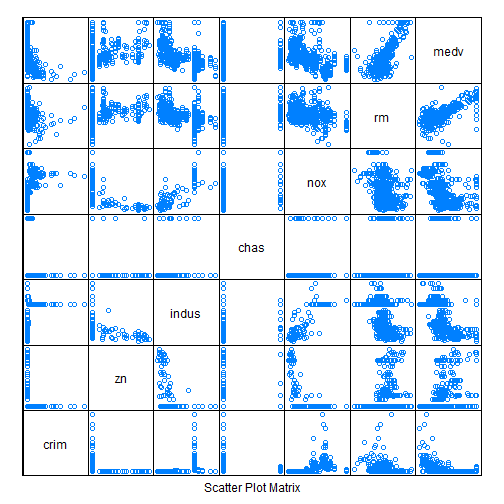
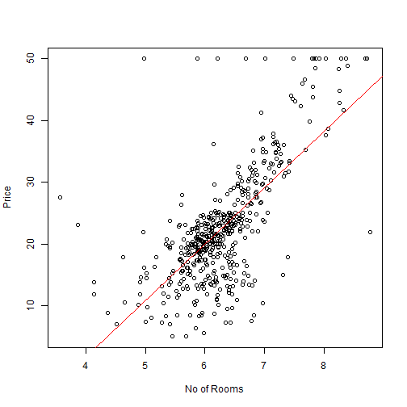
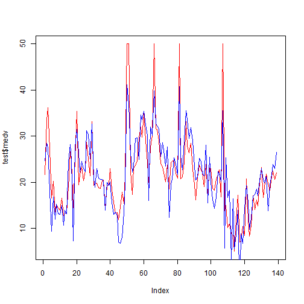

```r
# Import the dataset
# Loading the Dataset  into R
library(MASS)
data("Boston")
head(Boston)
```


```r
# Splitting of the dataset 
set.seed(2)
library(caTools)
#spluting the data set into 30-70
split <- sample.split(Boston$medv, SplitRatio = 0.7)
train <- subset(Boston, split == "TRUE")
test <- subset(Boston, split == "FALSE")
```


```r
library(lattice)
splom(~Boston[c(1:6,14)],groups=NULL,data=Boston,axis.line.tck=0,axis.text.alpha=0)
```



```r
splom(~Boston[c(7:14)],groups=NULL, data=Boston,axis.line.tck=0,axis.text.alpha=0)
```


```r
# Studying the Rm and the Mdev correlation
plot(Boston$rm,Boston$medv, xlab="No of Rooms", ylab="Price")
abline(lm(Boston$medv~Boston$rm), col="red")
```




```r
model <- lm(medv~., data = train)
summary(model)
```

```
## 
## Call:
## lm(formula = medv ~ ., data = train)
## 
## Residuals:
##      Min       1Q   Median       3Q      Max 
## -15.4036  -2.8472  -0.5166   1.8768  24.3219 
## 
## Coefficients:
##               Estimate Std. Error t value Pr(>|t|)    
## (Intercept)  41.975065   6.171855   6.801 4.45e-11 ***
## crim         -0.124709   0.036198  -3.445 0.000639 ***
## zn            0.060213   0.016620   3.623 0.000334 ***
## indus         0.007313   0.073690   0.099 0.921005    
## chas          2.366739   1.074791   2.202 0.028308 *  
## nox         -21.354016   4.722318  -4.522 8.38e-06 ***
## rm            3.483738   0.487656   7.144 5.23e-12 ***
## age          -0.006623   0.015952  -0.415 0.678241    
## dis          -1.859822   0.245499  -7.576 3.17e-13 ***
## rad           0.337442   0.076949   4.385 1.53e-05 ***
## tax          -0.012126   0.004312  -2.812 0.005201 ** 
## ptratio      -0.886151   0.164662  -5.382 1.35e-07 ***
## black         0.008751   0.003099   2.824 0.005009 ** 
## lstat        -0.590932   0.060140  -9.826  < 2e-16 ***
## ---
## Signif. codes:  0 '***' 0.001 '**' 0.01 '*' 0.05 '.' 0.1 ' ' 1
## 
## Residual standard error: 4.914 on 353 degrees of freedom
## Multiple R-squared:  0.7408,	Adjusted R-squared:  0.7312 
## F-statistic:  77.6 on 13 and 353 DF,  p-value: < 2.2e-16
```


```r
# Now Using the Model to predict the output of the test set
predic <- predict(model , test)
predic
```

```
##         2         4         5         8         9        19        21        23        24        26        27 
## 24.656029 28.473532 27.539935 17.979518  9.355791 16.788991 11.973222 15.214866 13.118026 13.011280 14.971883 
##        31        34        35        36        42        44        49        53        56        67        72 
## 10.626577 13.904523 13.118864 24.365810 28.206488 24.774028  7.279261 27.637444 31.437358 26.389024 22.129821 
##        74        80        87        90        94        97       100       104       106       109       113 
## 24.574272 22.952297 22.325041 31.169414 30.233777 25.093348 32.598959 20.679362 18.967466 23.021787 20.849370 
##       114       119       123       130       131       132       133       134       135       139       143 
## 20.579199 20.609484 20.197376 13.928625 19.946350 19.321654 20.027049 15.610075 13.064231 13.526067 12.572386 
##       145       148       149       150       151       164       167       170       171       173       174 
##  7.041059  6.785428  7.991710 13.387963 19.690415 41.121325 36.948138 26.330991 22.181888 23.274072 29.482549 
##       178       186       188       189       190       195       202       210       223       224       226 
## 29.583868 24.960275 34.567599 33.563012 35.327191 32.367614 30.126554 16.007919 31.953609 30.092029 39.819834 
##       228       230       235       236       240       241       242       244       246       247       249 
## 32.706367 32.273853 31.657079 25.581005 28.568495 26.923358 23.485502 27.686124 12.313615 19.598980 20.736806 
##       252       255       256       268       270       271       273       278       293       303       306 
## 25.338516 23.901221 21.616361 40.749354 25.792204 22.714261 29.123971 35.455924 33.534069 29.439673 31.818368 
##       309       313       316       320       321       330       334       340       344       346       348 
## 28.916408 23.411959 20.454054 21.138592 25.133482 24.523611 21.873486 21.396876 28.103536 15.527532 25.510050 
##       351       353       355       356       358       359       364       371       374       376       380 
## 19.945361 16.250586 14.274620 16.640002 22.273489 21.910618 20.149961 35.548397  5.751807 25.367163 16.687428 
##       382       385       398       399       407       409       415       416       418       420       423 
## 18.257375  3.114080 16.471638  5.609525  8.583884 13.925293 -5.356915  8.886890  6.691125 14.340606 19.302304 
##       425       426       441       442       449       453       459       471       473       477       487 
## 15.635869  9.763681 12.223642 16.890124 17.287791 18.458897 17.049597 20.435526 22.897249 20.620844 19.831197 
##       494       497       498       499       502       503       505 
## 21.272238 13.857638 19.268103 21.687406 23.853432 22.904482 26.478693
```


```r
# Comparing predictions with actual values 
plot(test$medv, type = "l" , lty = 1.8 , col="red")
lines(predic, type="l", col = "blue")
```



```r
library(modelr)
R2 = rsquare(model, data = Boston)
RMSE = rmse(model, data = Boston)
MAE = mae(model, data = Boston)
```


```r
cat("R2 Score - ", R2)
```

```
## R2 Score -  0.7362341
```

```r
cat("\nRMSE Score - ", RMSE)
```

```
## 
## RMSE Score -  4.718833
```

```r
cat("\nMAE Score - ", MAE)
```

```
## 
## MAE Score -  3.378641
```

